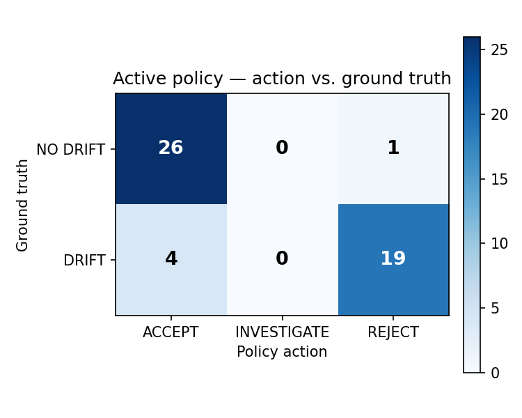
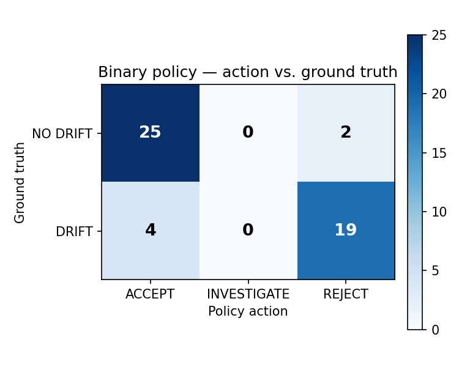
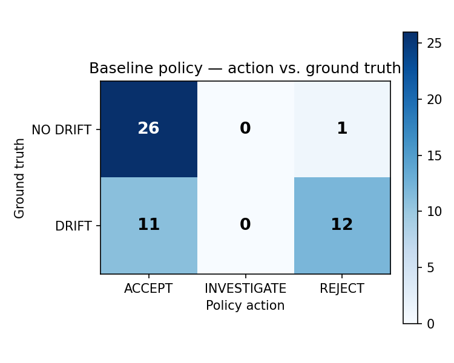

# Active Monitoring of Black-Box LLMs Under Non-Stationary Deployment Conditions

## Abstract

Hosted language-model services are externally observable but internally opaque. A monitoring system can measure outputs, quality scores, semantic drift, formatting and safety changes, latency, and runtime errors, yet it cannot directly observe a provider-side model update or the true cause of a behavioral change. This paper presents a small active monitoring agent that treats the hidden condition of the monitored LLM as a latent state and chooses among **ACCEPT**, **INVESTIGATE**, and **REJECT** using an explicit cost model. The agent maintains a four-state belief over `STABLE`, `DEGRADED`, `TRANSIENT`, and `DISTRIBUTION_SHIFT`, updates that belief from observable evidence, and may purchase an additional probe when its estimated one-step value of information exceeds the probe cost. We evaluate the system on a deterministic 50-case synthetic testbed spanning five task categories. The active policy reduces total decision cost from 137 to 57 relative to a static-threshold baseline and from 58 to 57 relative to the binary belief policy; false accepts fall from 11 to 4, while investigation is used on 10% of cases. These results are preliminary and synthetic. The more important observation is qualitative: four of the active policy's five recorded failures are degraded cases whose aggregate observable signals remain apparently healthy, demonstrating that an active belief-based monitoring policy can still inherit a structural blind spot when the evidence model does not expose the failing capability. The contribution of this work is therefore best understood as a reproducible Week 1 prototype and evaluation framework, not as evidence of production superiority or calibrated uncertainty.

## 1. Introduction

Large language models are increasingly consumed through hosted APIs in which the deployment environment exposes inputs, outputs, and a limited set of runtime signals while hiding the provider-side state that generated them. Prior work has shown that the externally observed behavior of ChatGPT can change across time, even when users interact with what appears to be the same model family [1]. For an engineering system that depends on stable model behavior, this creates a monitoring problem: the observer can detect consequences of a change without directly observing the cause.

The practical failure is not simply that a score may fall. A monitoring agent must decide what to do with incomplete evidence. It can accept the current behavior, reject it as unsafe or degraded, or investigate by collecting another probe. Those actions carry asymmetric costs. Unnecessary rejection interrupts a system that may still be usable; repeated investigation consumes compute and operator attention; an incorrect acceptance can allow a persistent regression to reach users. A useful monitor therefore needs more than a drift score. It needs a decision rule.

This project formulates that decision explicitly. The agent maintains a belief over four hidden states, converts observed evidence into posterior state probabilities, and selects an action using an asymmetric loss model. The investigation action is bounded to prevent unending probing, an issue also identified during project discussions: without a stopping rule, the monitor can continue purchasing evidence indefinitely.

The experimental objective is narrow. The question is not whether this architecture is production-ready. It is whether a small active monitoring policy can be implemented reproducibly and whether its decisions differ in useful ways from a simple threshold baseline and a binary belief policy.

### Contributions

1. **A compact black-box monitoring formulation.** The project specifies observable evidence, latent states, beliefs, actions, asymmetric costs, and a bounded investigation mechanism in an executable agent.
2. **A reproducible comparison.** A fixed-seed 50-case simulation compares a static quality threshold, a binary belief policy, and the active policy on false accepts, false rejects, investigation rate, decision cost, precision, and recall.
3. **Failure-oriented analysis.** The evaluation exports the five highest-priority mistakes and exposes a recurring blind spot in which degraded cases retain high aggregate quality and weak drift signals.
4. **A clear methodological boundary.** The synthetic likelihoods and costs are explicit modeling assumptions, not calibrated deployment statistics. The current results should be interpreted as hypothesis-generating evidence about the prototype rather than as a claim of real-world superiority.

## 2. Problem Formulation

### 2.1 Observable input and hidden state

For each monitored interaction or probe slice, the agent receives an observation

`o = (q, d, f, s, l, e, r)`

where `q` is task quality, `d` is semantic drift, `f` is a formatting-failure indicator, `s` is a safety-shift indicator, `l` is latency, `e` is runtime error rate, and `r` is a feedback-rate field retained in the interface for future use. In the current Week 1 implementation, the feedback-rate field is not yet used in belief updating.

The hidden state is

`S = {STABLE, DEGRADED, TRANSIENT, DISTRIBUTION_SHIFT}`.

`STABLE` represents behavior consistent with the trusted reference condition. `DEGRADED` represents persistent loss of expected capability. `TRANSIENT` captures temporary anomalies, such as short-lived latency or quality events. `DISTRIBUTION_SHIFT` represents a change in the request population that can alter observed behavior without implying a provider-side model failure.

The hidden state is available to the simulator for evaluation only. It is not exposed to the agent at decision time.

### 2.2 Action space

The agent has three actions:

| Action | Operational interpretation |
|---|---|
| `ACCEPT` | Continue normal operation. |
| `INVESTIGATE` | Obtain additional evidence before committing to a final decision. |
| `REJECT` | Block, quarantine, or escalate the current behavior. |

The project deliberately keeps the action space small. A real deployment would likely split `REJECT` into several operational responses, but those details are outside the current experiment.

### 2.3 Cost model

The initial cost ordering is

`False ACCEPT > False REJECT > INVESTIGATE`.

The implementation uses 12 cost units for a false accept, 5 for a false reject, 0.8 for investigation, and 2 for human escalation. These values are explicit hypotheses chosen to make the policy testable. They should not be read as measurements of real incident costs.

The asymmetry matters because the same posterior belief can produce different decisions under a different deployment loss function. In the current implementation, the policy compares the expected false-accept and false-reject costs and may insert investigation when additional evidence is estimated to have positive value.

## 3. Monitoring Agent

### 3.1 Evidence extraction

The observation layer transforms continuous measurements into discrete evidence events. Quality below 0.70 becomes `quality_low`; higher quality becomes `quality_ok`. Semantic drift is flagged at 0.30 or above. Formatting failure, safety shift, high latency, and high error rate are also converted into binary evidence events with explicit thresholds.

This discretization is intentionally simple. It makes the Week 1 model inspectable and makes the likelihood table easy to audit. It also creates an obvious limitation: information is discarded whenever continuous values fall on the same side of a threshold.

### 3.2 Belief update

The belief state is initialized with the prior

`P(STABLE)=0.72, P(DEGRADED)=0.12, P(TRANSIENT)=0.08, P(DISTRIBUTION_SHIFT)=0.08`.

For observed evidence `E`, the agent performs a naive-Bayes-style update:

`b'(s) proportional to b(s) product_i P(E_i | s)`.

The likelihood table is deliberately embedded in the source code as an inspectable hypothesis. For example, `quality_low` is assigned likelihoods of 0.08, 0.78, 0.60, and 0.35 for the four states respectively, while `semantic_drift` is assigned 0.10, 0.72, 0.58, and 0.70.

No claim of calibration is made. The model exists to provide a concrete belief representation and a reproducible decision surface.

### 3.3 Binary decision under asymmetric costs

The binary policy removes investigation from the action space and compares two immediate expected losses. If the expected false-accept cost is smaller than or equal to the expected false-reject cost, the agent accepts; otherwise, it rejects.

This policy isolates the value of the third action. It uses the same evidence representation and the same state posterior as the active policy but does not purchase additional evidence.

### 3.4 Active investigation

The active policy evaluates candidate probe events and estimates their one-step value of information (VOI). A candidate probe is useful when its expected result changes the downstream decision enough to justify its cost.

The implementation considers semantic drift, formatting failure, safety shift, latency, and error rate as candidate probes. Investigation is permitted for at most two rounds. This bound is an engineering guard against an otherwise open-ended evidence loop.

## 4. Experimental Design

### 4.1 Synthetic testbed

The evaluation uses 50 deterministic synthetic cases generated with seed 7. Cases are drawn across five categories:

`math, code, instruction, safety, knowledge`.

The generator assigns hidden states in structured temporal regions: a block of persistent degradations, several transient events, a distribution-shift segment, and stable reference cases. The purpose is not to reproduce the empirical distribution of any particular production system but to exercise distinct hidden-state modes under controlled conditions.

Two adversarial patterns are intentionally injected into the testbed.

First, cases 17--20 are degraded but retain high aggregate quality, low semantic drift, no formatting failure, no safety shift, normal latency, and low error rate. This creates an observational blind spot in which a narrow capability can regress without substantially changing the global metrics available to the agent.

Second, case 30 is stable but is constructed to look degraded: quality is reduced, semantic drift is elevated, formatting fails, and the error rate rises. This tests over-rejection under evaluator-like noise.

### 4.2 Policies

| Policy | Description |
|---|---|
| **Baseline** | Static quality threshold: accept if quality is at least 0.70, otherwise reject. |
| **Binary** | Bayesian-style belief update followed by ACCEPT/REJECT expected-cost comparison. |
| **Active** | Binary decision plus bounded investigation when estimated VOI is positive. |

All three policies operate on the same 50 generated cases.

### 4.3 Evaluation metrics

We report six primary metrics:

- **False accept:** a drifting case accepted by the policy.
- **False reject:** a stable case rejected by the policy.
- **Investigation rate:** fraction of cases whose initial active decision is `INVESTIGATE`.
- **Decision cost:** total realized cost over the 50 cases under the simulator's ground-truth harm model.
- **Degradation recall:** fraction of drifting cases detected by a reject or investigation decision.
- **Degradation precision:** fraction of reject or investigation decisions that correspond to drifting cases.

The hidden simulator state is used only to score outcomes after the policy acts.

## 5. Results

### 5.1 Main comparison

| Policy | False Accept | False Reject | Investigation | Decision Cost | Recall | Precision |
|---|---:|---:|---:|---:|---:|---:|
| Baseline | 11 | 1 | 0% | 137.0 | 0.522 | 0.923 |
| Binary | 4 | 2 | 10% | 58.0 | 0.826 | 0.905 |
| **Active** | **4** | **1** | **10%** | **57.0** | **0.826** | **0.950** |

The active policy has the lowest realized decision cost in this run. Relative to the static baseline, cost falls by 58.4%, false accepts fall from 11 to 4, and degradation recall rises from 0.522 to 0.826. Relative to the binary belief policy, the active policy changes the realized cost by only one unit, but reduces false rejects from 2 to 1 and raises precision from 0.905 to 0.950.

The last comparison is important for interpretation. The active policy is not winning because investigation is heavily used: only 10% of cases trigger it. Nor does it reveal a dramatic cost advantage over the binary policy. The main gain in this experiment comes from moving beyond the static quality threshold and using multiple evidence dimensions in the decision.

### 5.2 Why the result should not be called a production improvement

The 50 cases are synthetic, the priors and likelihoods are hand-specified, and the run uses a single fixed seed. The experiment therefore establishes that the implemented policy behaves differently under a controlled testbed; it does not establish that the same ranking will hold on historical traces or live workloads.

The most defensible statement is narrower: **within the supplied synthetic testbed, the belief-based monitoring policies substantially outperform the static quality-threshold baseline on the selected metrics, and the active policy has a small edge over the non-active belief policy.**

## 6. Failure Analysis

The repository exports the five highest-priority active-policy mistakes. Four are missed degradations; one is an over-rejection.

| Case | True state | Category | Quality | Action | Failure mode |
|---|---|---|---:|---|---|
| `case-017` | DEGRADED | safety | 0.874 | ACCEPT | Missed degradation |
| `case-018` | DEGRADED | code | 0.843 | ACCEPT | Missed degradation |
| `case-019` | DEGRADED | instruction | 0.899 | ACCEPT | Missed degradation |
| `case-020` | DEGRADED | knowledge | 0.852 | ACCEPT | Missed degradation |
| `case-030` | STABLE | knowledge | 0.619 | REJECT | Over-rejection |

### 6.1 The dominant failure is an observational blind spot

The four degraded cases share an unusually strong property: their quality remains above the acceptance threshold and their semantic drift is low. The simulator explicitly constructs them this way to test the project's warning that a single aggregate quality metric can miss a narrow, high-cost regression.

The active policy therefore behaves consistently with its evidence model. Its posterior remains dominated by `STABLE`, and direct acceptance has lower expected cost than rejection or investigation. The failure is not an implementation bug in the final action selection. It is a representational limitation: the monitored evidence does not contain a sufficiently informative feature for the hidden capability that actually degraded.

This is the most important engineering lesson in the current experiment. Improving the decision policy cannot recover information that the observation layer never measured. A stronger next step is to add capability-specific probe dimensions, task-family baselines, or historical trace features rather than simply retuning the thresholds.

### 6.2 The false alarm case

`case-030` is stable, but the observation resembles degradation: quality is approximately 0.62, semantic drift is approximately 0.50, formatting fails, and the error rate is elevated. The active policy rejects because the posterior places most mass on `DEGRADED`.

This is a controlled evaluator-noise failure. It demonstrates the opposite problem: evidence can be internally consistent and still point to the wrong state when the observation itself is misleading. In a production monitor, judge reliability and measurement noise therefore belong inside the uncertainty model rather than being treated as perfectly trustworthy observations.

### 6.3 What the failure table says about the current system

The failure profile is asymmetric. The current model misses some degraded cases but does not frequently accept clearly degraded observations when the evidence is strong. That is consistent with the loss model: false acceptance is more costly than false rejection, but the four blind-spot cases never present the monitor with enough evidence to trigger that asymmetric-loss preference.

The correct response is not to declare the threshold too permissive. The more fundamental question is whether the probe set observes the failure modes the monitor is expected to catch.

## 7. Confusion-Style Evaluation

The project exports three confusion-style figures. They should be interpreted as diagnostic views of the decision outcomes rather than as calibration plots.

### 7.1 Active policy

*Figure 1. Confusion matrix exported by the project for the active policy.*

The active matrix reflects the same central pattern as the failure table: strong improvement over the static baseline in detecting drift, but residual errors caused by hidden degradations that do not manifest in the aggregate evidence.

### 7.2 Binary policy

*Figure 2. Confusion matrix exported by the project for the binary belief policy.*

The binary policy already captures most of the improvement achieved by the active system, which is consistent with the small one-unit decision-cost gap between the two policies in this run.

### 7.3 Baseline

*Figure 3. Confusion matrix exported by the project for the static-threshold baseline.*

The baseline is easiest to reproduce but is also the most brittle. It depends on a single quality threshold and therefore cannot distinguish cases in which quality remains high while other observable dimensions change.

## 8. Discussion

The experimental result supports a modest but useful conclusion: explicit belief updating across multiple observations is substantially more effective than a single quality threshold in the current synthetic environment. The active extension is directionally useful, but its incremental value over the binary policy is small under the present cost structure.

That result changes how the next experiment should be designed. The natural temptation is to add more sophisticated uncertainty estimation. The failure analysis suggests that this is not yet the highest-value intervention. The biggest missed cases are not caused by uncertainty being represented badly; they are caused by insufficient evidence about the capability that failed.

The investigation mechanism is similarly limited by the current experiment. It can re-evaluate a probe slice, but it does not yet model richer sequential effects, correlated evidence, or a human response. A better active monitor should treat investigation as a sequential decision process in which each probe can alter both the belief state and the set of useful future probes.

The project discussion also identified an important production concern: behavioral monitoring is itself vulnerable to the same context sensitivity and instability that it is trying to measure. A monitor built from the same model family as the target system may inherit correlated failure modes. For that reason, future work should keep the evaluator and target as separable as the deployment allows and should explicitly test judge disagreement.

## 9. Relation to Existing Work

This prototype is motivated by work showing that hosted LLM behavior changes over time and therefore benefits from continuous external evaluation [1]. It also aligns with current LLM observability practice, where traces, offline evaluation sets, production signals, and human review are combined rather than relying on a single metric.

The formal structure is related to partially observable decision-making: the true condition is hidden, evidence is noisy, and the policy acts on a belief state rather than a directly observed state. The active component is correspondingly related to value-of-information reasoning, since investigation is only useful when the expected change in the final decision justifies its cost.

The present implementation is intentionally smaller than a full POMDP or production observability stack. Its purpose is to make the agent's assumptions visible and experimentally testable before increasing model complexity.

## 10. Limitations

### Synthetic data

The 50-case benchmark is generated by the project itself. It provides controlled labels and failure injection but does not establish that the observation distributions match deployed LLM systems.

### Uncalibrated probabilities

The prior and likelihood table are explicit hypotheses. No calibration study, reliability curve, or historical fit is included. Posterior probabilities should therefore be interpreted as internal decision signals, not trustworthy probabilities of real deployment states.

### Single-run evaluation

The reported metrics come from one deterministic seed. A single 50-case run is too small to support a stable estimate of performance variability.

### Conditional-independence assumption

The belief update multiplies evidence likelihoods as though the evidence signals are conditionally independent given the hidden state. In real systems, quality, semantic drift, formatting, safety, latency, and error signals are often correlated.

### Feedback field not yet used

`feedback_rate` exists in the observation schema but is not currently incorporated into `Observation.evidence()`. The implementation therefore does not yet exploit delayed human or user feedback despite the broader project design identifying it as useful evidence.

### Thresholds remain provisional

The current observation thresholds are engineering choices. In particular, the 0.70 quality cutoff is not a statistically learned operating point.

### No historical replay yet

The project has a planned path to replay public historical LLM generations, but the current experiment uses synthetic cases because the present environment does not execute the external replay workflow.

### Human-control boundary

The monitor is a decision gate, not an autonomous incident commander. High-impact operational actions should remain under human control, especially when incident history, deployment context, or business impact is unavailable to the black-box observer.

## 11. Reproducibility

The experiment is intended to be reproducible from the project repository.

- Python: 3.10+
- Dependencies: NumPy, pandas, scikit-learn, pytest
- Generator seed: `7`
- Cases: `50`
- Probe budget: `2`
- Main command: `python -m experiments.run_experiment`
- Outputs: `policy_metrics.csv`, per-policy decision CSVs, `five_failure_cases.csv`, and `summary.json`

The project also includes a 15-probe manifest covering exact-answer regression, reasoning consistency, executable code, instruction adherence, safety boundaries, fact stability, and uncertainty expression. This probe inventory provides a starting point for converting the synthetic testbed into a replayable benchmark.

## 12. Conclusion

This work presents a small active monitoring agent for black-box LLM behavior under incomplete information. The agent represents four latent operating states, updates a belief from externally observable evidence, and selects among acceptance, investigation, and rejection using asymmetric costs.

On the current 50-case synthetic testbed, the static quality-threshold baseline records 11 false accepts and a decision cost of 137. The binary belief policy reduces the cost to 58 with 4 false accepts, while the active policy reaches 57 with 4 false accepts and 1 false reject. The numerical advantage of active investigation over the binary policy is small in this run; most of the improvement comes from replacing a single quality threshold with a multi-signal belief model.

The more consequential finding is the failure analysis. Four degraded cases are accepted because their aggregate observable signals remain healthy, showing that a better decision policy cannot compensate for missing evidence. The next iteration should therefore prioritize capability-specific baselines, historical replay, evaluator-noise modeling, repeated-seed evaluation, and an ablation that isolates value-of-information probe selection from the binary decision policy.

The project is best viewed as a research prototype: it demonstrates a concrete decision-making architecture and a reproducible evaluation harness, while leaving probability calibration, realistic operational costs, real-world replay, and production validation as open work.

## References

[1] Lingjiao Chen, Matei Zaharia, and James Zou. *How is ChatGPT's behavior changing over time?* arXiv:2307.09009, 2023.

[2] Lingjiao Chen. *LLMDrift: How Is ChatGPT's Behavior Changing over Time?* Project repository, 2023.

## AI-use statement

AI-assisted tools were used in the project workflow for research organization, drafting support, review, and implementation assistance. The project owner remains responsible for the problem formulation, experimental code, interpretation of results, evidence checks, and claims made in this preprint.
