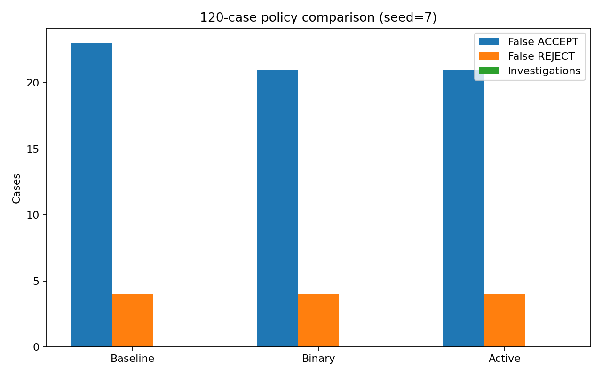

# Experiment Report — Section 18 (120 cases)

| Policy | Cases | False Accept | False Reject | Investigations | Investigation Rate | Decision Cost | Recall | Precision |
|---|---:|---:|---:|---:|---:|---:|---:|---:|
| baseline | 120 | 23 | 4 | 0 | 0% | 242.0 | 0.549 | 0.875 |
| binary | 120 | 21 | 4 | 0 | 0% | 222.0 | 0.588 | 0.882 |
| active | 120 | 21 | 4 | 0 | 0% | 222.0 | 0.588 | 0.882 |

Seed: `7`. All three policies were evaluated on the same generated 120-case dataset. The active policy did not choose `INVESTIGATE` in this run under the current hypothetical cost model, so its results match the binary policy.

The simulator extension preserves the original first 50-case structure and generates additional cases using the same state-specific observation generator. This is a reproducibility/scaling check; it should not be treated as deployment evidence.
